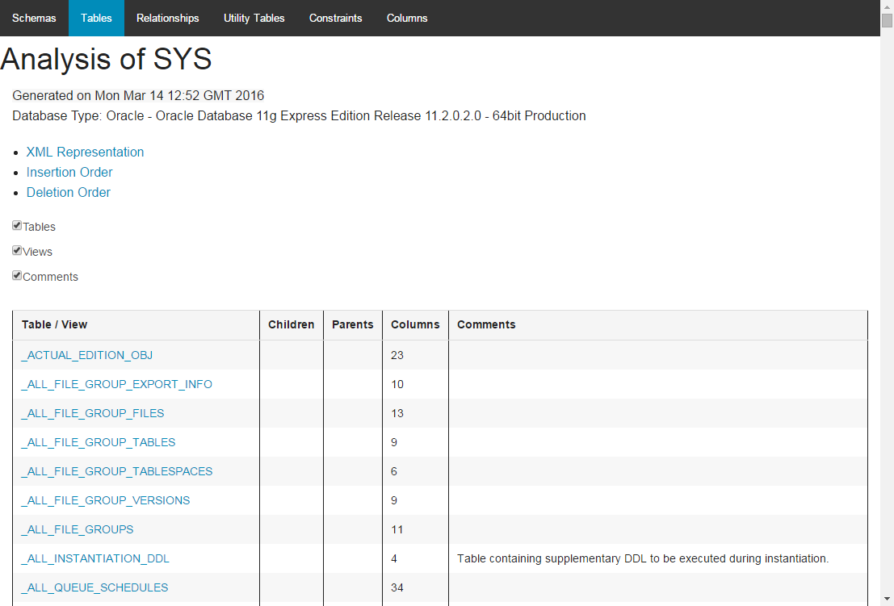

# SchemaSpy - Prettified

This repository contains a custom version of [SchemaSpy](http://schemaspy.sourceforge.net/) customised with a number of features and enhancements not found in the original project.

## Features and enhancements

- A modern stylesheet for screen and print based on Foundation (no more lime green - yay!)
- Responsive design, including the removal of many layout tables.
- The '-showanomalies' flag, which makes the 'anomalies' tab visible. The default is now false.
- Make comments visible by default
- The '-ga' flag, which lets you specify a Google Analytics tracking code to include in all output
- The '-showdbname' flag, which shows the database schema name in table descriptions. The default is now false.
- The donation links have been removed. There is still a link to the SchemaSpy website.

## Screenshot

## Credits and acknowledgements

- The [SchemaSpy project](http://schemaspy.sourceforge.net/) and its creator, John Currier
- [Kuali](https://github.com/kuali/schemaspy), who forked the original project and packaged it as a Maven artefact
- Foundation and its components:
 - [Placeholder.js](http://mths.be/placeholder) - MIT licence
 - [Normalize.css](https://github.com/necolas/normalize.css) - MIT licence
 - [Modernizr.js](http://www.modernizr.com) - BSD and MIT licence
 - [JQuery](http://jquery.com/) - MIT licence
- My agent

## Licence

[LGPL 2.1](http://www.gnu.org/licenses/lgpl-2.1.html), like SchemaSpy.

## Contact

Graeme West (see commits for email address).
